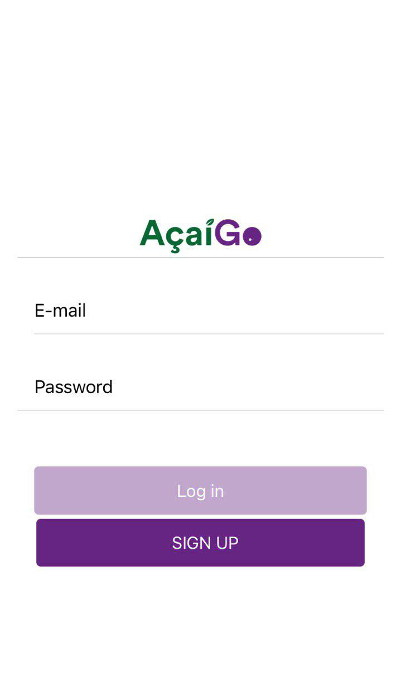
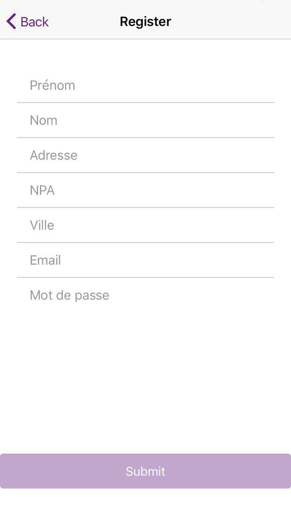
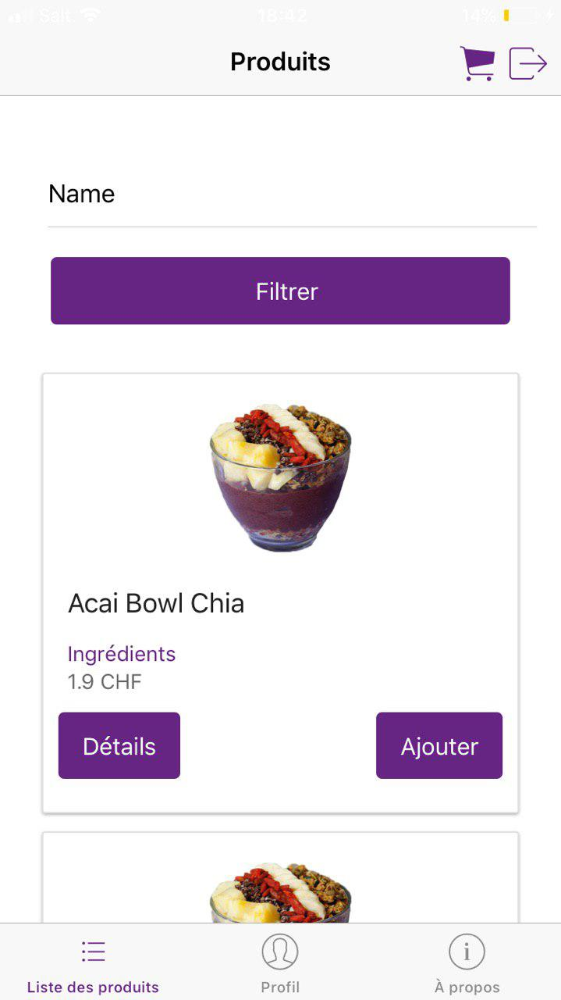
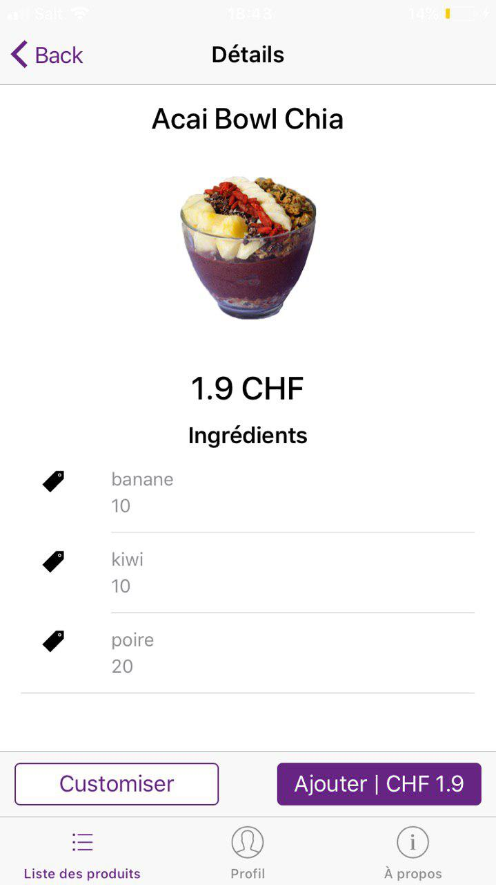
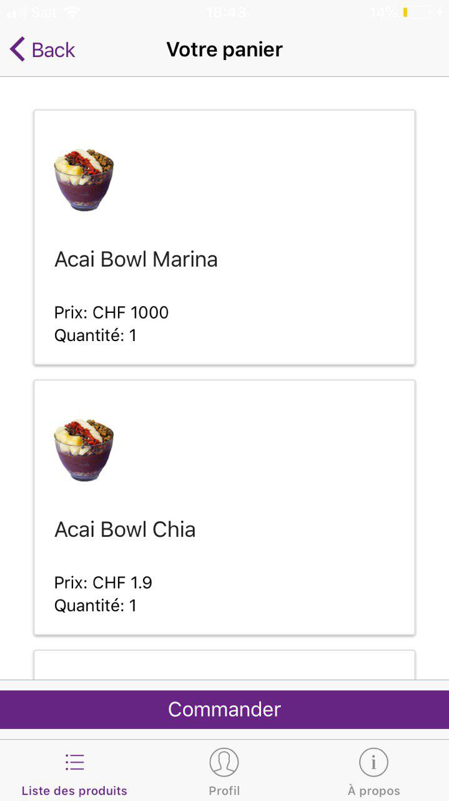
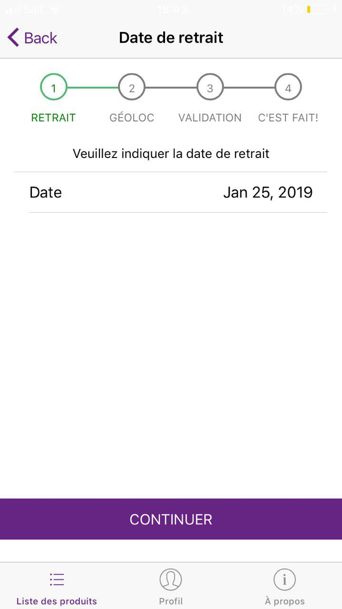
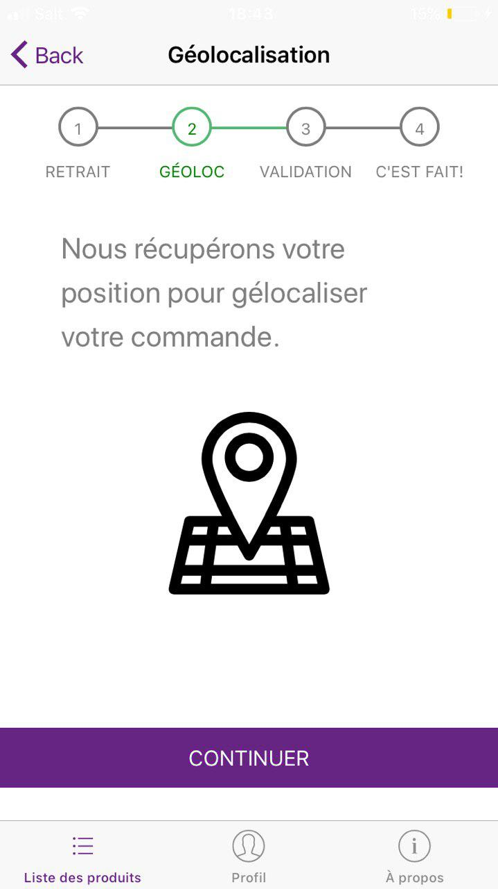
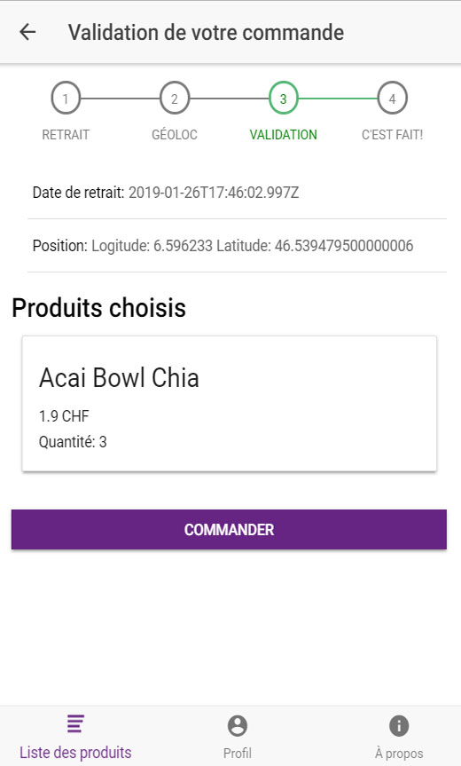
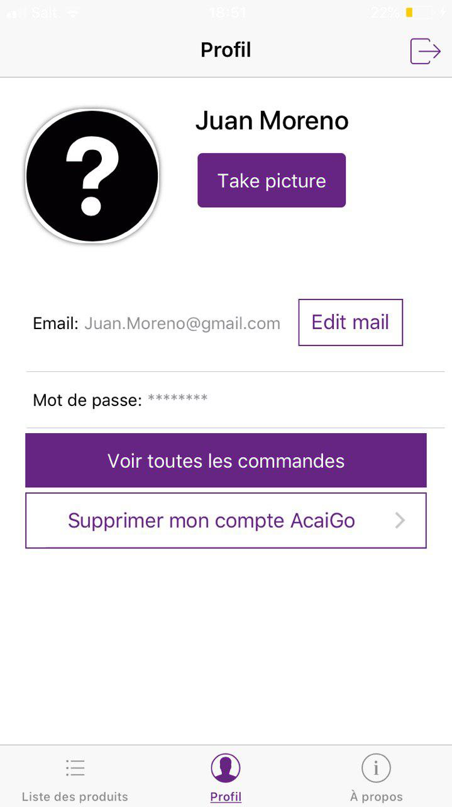

---

The creation of this application was done as part of the "AppMob" course at [HEIG-VD](https://heig-vd.ch/). The goal of this course was to learn how to develop a hybrid mobile application,
and upload it on the App Store and Google Store.

## Table of contents
* [The application](#the-application)
* [Technologies](#technologies)
* [Setup](#setup)
* [How to launch the application](#How-to-Launch-the-application)
* [Demo](#Demo)

## The application
The AçaiGo App gives you the quickest, easiest way to place an order for acai bowls and then go to the store to pick them up.
You can see all the ingredients of each bowls before choosing it. All your orders will be geolocated so that you can see where you were when you placed an order. Isn't it great? :smiley:

### Features

* Login
* Registration
* Search a product
* See product details
* Create an order of products
* Edit the quantity of the product
* See the user profil
* Edit the user email
* Delete the user account
* Geolocate the user's orders
* Take a profile picture

	
## Technologies
Project is created with:

* [Node: version 8](https://angularjs.org/)
* [Angular: version 5.2.11](https://angularjs.org/)
* [Ionic: version 3](https://ionicframework.com/getting-started/)
* [Cordova](https://cordova.apache.org/) 
* [leaflet: version 1.4.0](https://leafletjs.com/)
* [HTML 5](https://www.w3.org/TR/html52/)
* [CSS](https://www.w3.org/Style/CSS/)

## Setup

Clone the source locally:

```
git clone git@github.com:juanmorenoHEIG/AcaiGo.git
cd acaiGo_App
npm install
```

## How to launch the application

### Ionic DevApp

  Download Ionic DevApp on the [App Store](https://itunes.apple.com/us/app/ionic-devapp/id1233447133?mt=8) or [Google Store](https://play.google.com/store/apps/details?id=io.ionic.devapp&hl=fr_CH)
  
  Login or Create New Account.
  
  Follow the instructions on the App.
  
## Demo

### Step 1: Login or create new account






----

### Step 2: Pick a bowl or see the details of the product







----

### Step 3: Click on add and you can see your shopping cart




----

### Step 4: Click on continue, you now have to pick the date when you want to pick up the bowl from the store




----

### Step 5: Click on continue, your order is now geolocated




----

### Step 6: Validate your order




----

### Your profile

You can edit your e-mail address or delete your account. But also take your profile picture!




----


Click on see all orders to see the geolocation of all your orders


