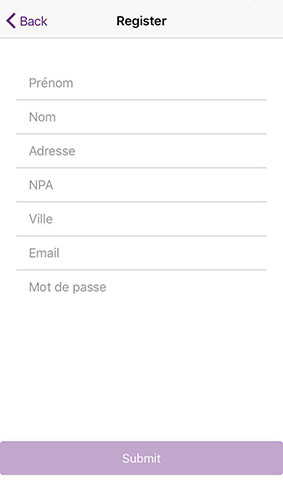

---

The creation of this application was done as part of the "AppMob" course at [HEIG-VD](https://heig-vd.ch/). The goal of this course was to learn how to develop a hybrid mobile application,
and upload it on the App Store and Google Store.

## Table of contents
* [The application](#the-application)
* [Technologies](#technologies)
* [Setup](#setup)
* [How to launch the application](#How-to-Launch-the-application)
* [Demo](#Demo)

## The application
The AçaiGo App gives you the quickest, easiest way to place an order for acai bowls and then go to the store to pick them up.
You can see all the ingredients of each bowls before choosing it. All your orders will be geolocated so that you can see where you were when you placed an order. Isn't it great? :smiley:

### Features

* Login
* Registration
* Search a product
* See product details
* Create an order of products
* Edit the quantity of the product
* See the user profil
* Edit the user email
* Delete the user account
* Geolocate the user's orders
* Take a profile picture

	
## Technologies
Project is created with:

* [Node: version 8](https://angularjs.org/)
* [Angular: version 5.2.11](https://angularjs.org/)
* [Ionic: version 3](https://ionicframework.com/getting-started/)
* [Cordova](https://cordova.apache.org/) 
* [leaflet: version 1.4.0](https://leafletjs.com/)
* [HTML 5](https://www.w3.org/TR/html52/)
* [CSS](https://www.w3.org/Style/CSS/)

## Setup

Clone the source locally:

```
git clone git@github.com:juanmorenoHEIG/AcaiGo.git
cd acaiGo_App
npm install
```

## How to launch the application

### Ionic DevApp

  Download [Ionic DevApp](https://itunes.apple.com/us/app/ionic-devapp/id1233447133?mt=8) on the App Store
  
  Login or Create New Account.
  
  Follow the instructions on the App.
  
## Demo

### Step 1: Login or create new account





